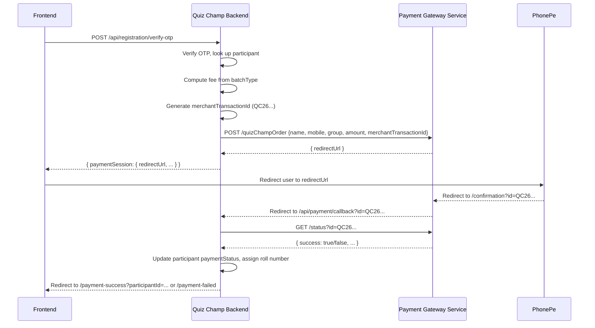

# Design Document — PhonePe Payment Integration

## Overview

Replace the mock payment service in the Quiz Champ Backend (QCB) with a real integration against the existing Satyalok Payment Gateway Service (PGS), which wraps PhonePe. The integration is server-to-server between QCB and PGS; the frontend only receives a redirect URL and never calls the PGS directly.

Fixed registration fees are enforced server-side:
- **JUNIOR** → ₹100
- **SENIOR** → ₹150

## Architecture



## Components and Interfaces

### 1. `pgsClient.ts` — Payment Gateway Service HTTP client

A thin wrapper around `axios` that handles authentication and base URL configuration.

```typescript
interface PGSOrderRequest {
  name: string;
  mobile: string;
  group: 'JUNIOR' | 'SENIOR';
  amount: number;
  merchantTransactionId: string;
}

interface PGSOrderResponse {
  redirectUrl: string;
}

interface PGSStatusResponse {
  success: boolean;
  data?: {
    transactionId: string;
    amount: number;
    state: string;
  };
  message?: string;
}
```

### 2. Updated `payment.ts` service

Replaces the mock implementation. Exposes:

- `getRegistrationFee(batchType: BatchType): number` — pure function, no I/O
- `generateMerchantTransactionId(): string` — returns `QC26{timestamp}{randomChar}`
- `initiatePhonePePayment(participant): Promise<{ redirectUrl: string; merchantTransactionId: string }>` — calls PGS
- `verifyPhonePePayment(merchantTransactionId: string): Promise<{ success: boolean; transactionId?: string }>` — calls PGS status

### 3. New `GET /api/payment/callback` route

Handles the redirect from PGS after PhonePe completes. Looks up the participant by `merchantTransactionId`, calls PGS status, updates the DB, then redirects the browser.

### 4. Updated `POST /api/registration/verify-otp` route

After OTP verification, calls `initiatePhonePePayment` instead of the mock `createPaymentSession`. Returns `{ redirectUrl, merchantTransactionId }` in the response.

### 5. Frontend — `PaymentGateway.tsx`

Instead of calling `confirmPayment`, the frontend receives a `redirectUrl` and performs a `window.location.href = redirectUrl` to send the user to PhonePe.

New frontend pages needed:
- `/payment-success?participantId=...` — polls or fetches admit card
- `/payment-failed` — shows failure message with retry option

## Data Models

No new MongoDB models are needed. The existing `Participant` model gains one field:

```typescript
merchantTransactionId?: string;  // stored so the callback can look up the participant
```

The `paymentId` field (already present) will store the PhonePe `transactionId` returned on success.

## Correctness Properties

*A property is a characteristic or behavior that should hold true across all valid executions of a system — essentially, a formal statement about what the system should do. Properties serve as the bridge between human-readable specifications and machine-verifiable correctness guarantees.*

---

**Property 1: Fee lookup is total and canonical**

*For any* valid `BatchType` value (`JUNIOR` or `SENIOR`), `getRegistrationFee(batchType)` SHALL return the canonical fee for that type (100 for JUNIOR, 150 for SENIOR), and the result SHALL NOT depend on any argument other than `batchType`.

**Validates: Requirements 1.1, 1.2, 1.3**

---

**Property 2: Merchant Transaction ID format and uniqueness**

*For any* collection of N generated Merchant Transaction IDs, every ID SHALL start with the prefix `QC26`, and all N IDs SHALL be distinct from one another.

**Validates: Requirements 2.1**

---

**Property 3: PGS outbound request is well-formed**

*For any* participant record, the HTTP request sent to `POST /quizChampOrder` SHALL contain the participant's `name`, `mobileNumber`, `batchType`, the canonical fee for that `batchType`, the generated `merchantTransactionId`, and the `x-api-key` header set to the value of `PGS_API_KEY`.

**Validates: Requirements 2.2, 5.1**

---

**Property 4: Redirect URL pass-through**

*For any* redirect URL returned by the PGS, the `verify-otp` endpoint response SHALL contain that exact URL in the `paymentSession.redirectUrl` field.

**Validates: Requirements 2.3**

---

**Property 5: PGS error propagates as 502**

*For any* error response (network failure, 4xx, 5xx) from the PGS during order initiation, the QCB SHALL respond with HTTP 502 and the participant's `paymentStatus` SHALL remain `PENDING`.

**Validates: Requirements 2.4, 5.2**

---

**Property 6: Callback status drives participant state**

*For any* payment callback, after the QCB calls the PGS status endpoint:
- If `success === true`, the participant's `paymentStatus` SHALL be `COMPLETED` and `rollNumber` SHALL be assigned.
- If `success === false`, the participant's `paymentStatus` SHALL be `FAILED`.

**Validates: Requirements 3.2, 3.3, 3.4**

---

**Property 7: Callback redirect targets correct frontend page**

*For any* payment callback outcome, the browser redirect SHALL point to the frontend success page (containing the `participantId`) when payment succeeded, and to the frontend failure page when payment failed.

**Validates: Requirements 4.1, 4.2**

---

## Error Handling

| Scenario | QCB behaviour |
|---|---|
| PGS unreachable | HTTP 502 to frontend; participant stays PENDING |
| PGS returns 401 | HTTP 502 to frontend; log "PGS auth failed" |
| PGS returns 4xx/5xx on order | HTTP 502 to frontend |
| Callback: PGS status call fails | HTTP 502; log error; participant stays PENDING |
| Callback: participant not found by merchantTransactionId | HTTP 404; log warning |
| Duplicate callback (already COMPLETED) | Return 200 immediately; skip re-processing |

## Testing Strategy

### Property-Based Testing

Library: **fast-check** (already available in the TypeScript ecosystem; add as a dev dependency).

Each property-based test runs a minimum of **100 iterations** with randomly generated inputs.

Each test is tagged with the format:
`// Feature: phonepe-payment-integration, Property N: <property text>`

| Property | Test description |
|---|---|
| Property 1 | Generate random `BatchType` values; assert fee is always 100 or 150 |
| Property 2 | Generate N IDs; assert all start with `QC26` and Set size equals N |
| Property 3 | Generate random participant objects; mock axios; assert outbound payload and headers |
| Property 4 | Generate random redirect URLs from PGS mock; assert they appear unchanged in response |
| Property 5 | Simulate PGS errors; assert 502 response and PENDING status |
| Property 6 | Generate random success/failure status responses; assert correct DB update |
| Property 7 | Generate random callback outcomes; assert redirect URL matches expected page |

### Unit Tests

- `getRegistrationFee` with both valid batch types and an invalid type (should throw)
- `generateMerchantTransactionId` called twice returns different values
- Callback handler with a pre-existing COMPLETED participant (idempotency)
- Callback handler when participant is not found (404)
