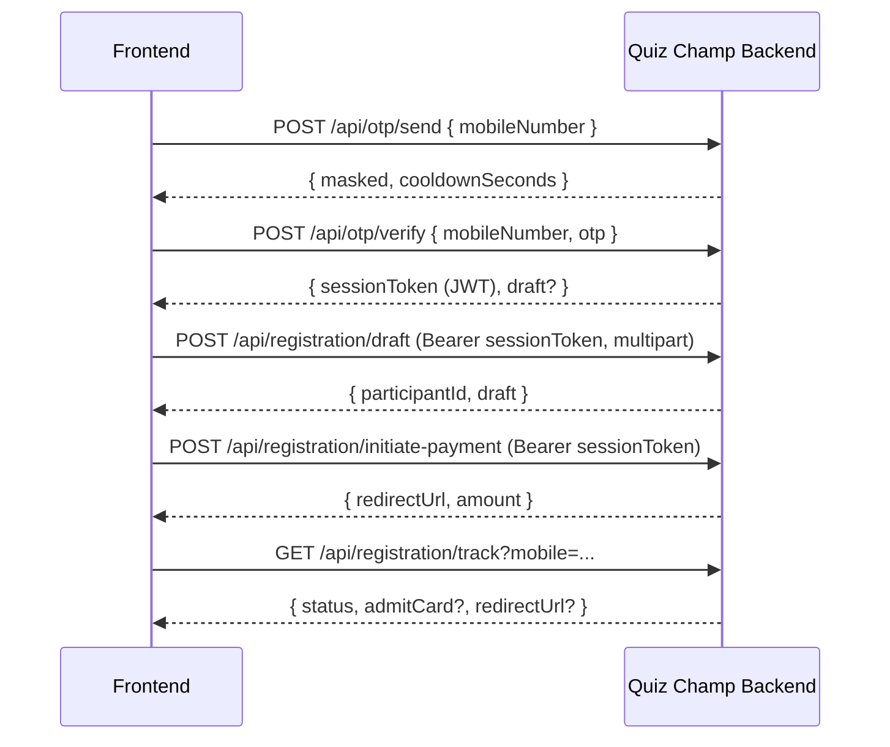

# Design Document — Registration Flow V2

## Overview

Redesign the registration flow to be OTP-first. Add draft saving, photo upload, payment tracking, rate limiting, and one-registration-per-mobile enforcement.

New flow:
```
Home → Select Batch → Enter Mobile → OTP → Form (pre-filled if draft exists) → Photo Upload → Payment → Success
```

## Architecture



## Components and Interfaces

### 1. New OTP routes (`src/routes/otp.ts`)

Replaces the OTP logic currently embedded in `registration.ts`.

```
POST /api/otp/send       — send OTP, enforce cooldown + rate limit
POST /api/otp/verify     — verify OTP, return JWT session token + draft if exists
```

### 2. Updated Registration routes (`src/routes/registration.ts`)

```
POST /api/registration/draft          — save/update draft (auth required, multipart for photo)
GET  /api/registration/draft          — get draft for authenticated mobile
POST /api/registration/initiate-payment — trigger PGS payment (auth required)
GET  /api/registration/track          — public status lookup by mobile number
GET  /api/registration/admit-card/:id — existing, unchanged
```

### 3. JWT Session Middleware (`src/middleware/sessionAuth.ts`)

Validates the short-lived JWT issued after OTP verification. Attaches `req.verifiedMobile` to the request.

### 4. Rate Limiter (`src/middleware/otpRateLimit.ts`)

Uses `express-rate-limit` (already installed) with a custom store backed by MongoDB or in-memory.

Two limiters:
- IP limiter: 10 req/min per IP
- Mobile limiter: 5 req/10min per mobile number + 60s cooldown

### 5. Photo upload

Reuses existing `multer` + S3 upload infrastructure. New field `photoUrl` on `IParticipant`.

### 6. Frontend pages/components

- `MobileEntry` — new first step (replaces BatchSelector → RegistrationForm direct link)
- `RegistrationForm` — updated to accept pre-filled draft data and photo upload
- `TrackingPage` — new page at `/track` showing status by mobile number

## Data Models

### IParticipant additions

```typescript
photoUrl?: string;        // S3 URL of admit card photo
otpVerifiedAt?: Date;     // when OTP was last verified for this number
```

### OTP rate limiting (in-memory or MongoDB)

Track per mobile: `{ mobileNumber, requestCount, windowStart, lastRequestAt, blockedUntil? }`

## Correctness Properties

*A property is a characteristic or behavior that should hold true across all valid executions of a system — essentially, a formal statement about what the system should do. Properties serve as the bridge between human-readable specifications and machine-verifiable correctness guarantees.*

---

**Property 1: Mobile masking**

*For any* valid 10-digit Indian mobile number, the OTP send response SHALL mask digits 3–8 (inclusive) with asterisks, leaving only the first 2 and last 2 digits visible.

**Validates: Requirements 1.2**

---

**Property 2: JWT session token correctness**

*For any* successful OTP verification for mobile number M, the returned JWT SHALL decode to contain M as the subject, and the expiry SHALL be between 25 and 35 minutes from the time of issuance.

**Validates: Requirements 1.3, 1.4**

---

**Property 3: Session token mobile binding**

*For any* JWT session token issued for mobile M, a form submission using that token with a different mobile number M' SHALL be rejected with HTTP 401.

**Validates: Requirements 1.4, 1.5**

---

**Property 4: Completed registration blocks OTP**

*For any* mobile number that has a participant record with `paymentStatus: COMPLETED`, a new OTP send request SHALL return HTTP 409.

**Validates: Requirements 2.1**

---

**Property 5: Pending draft is returned on re-verify**

*For any* mobile number that has a `PENDING` participant record, OTP verification SHALL return the existing draft data rather than creating a new record.

**Validates: Requirements 2.2**

---

**Property 6: OTP cooldown enforcement**

*For any* mobile number, a second OTP request within 60 seconds of the first SHALL be rejected with HTTP 429 and a `retryAfterSeconds` field greater than 0.

**Validates: Requirements 3.1, 3.4**

---

**Property 7: OTP burst limit**

*For any* mobile number, after 5 OTP requests within a 10-minute window, the next request SHALL be rejected with HTTP 429 and `retryAfterSeconds` indicating the remaining block duration.

**Validates: Requirements 3.2, 3.4**

---

**Property 8: IP rate limit**

*For any* IP address, after 10 OTP requests within 60 seconds, the next request SHALL be rejected with HTTP 429.

**Validates: Requirements 3.3**

---

**Property 9: Draft upsert idempotency and round-trip**

*For any* valid form submission with a valid session token, submitting the same data twice SHALL result in exactly one participant record, and a subsequent GET draft SHALL return data equivalent to the last submitted form.

**Validates: Requirements 4.1, 4.2, 4.3**

---

**Property 10: Photo file validation**

*For any* file upload, files with MIME type outside `{image/jpeg, image/png, image/webp}` or size exceeding 2 MB SHALL be rejected with HTTP 400, and files within those constraints SHALL be accepted.

**Validates: Requirements 5.1, 5.4**

---

**Property 11: Photo URL round-trip**

*For any* participant with a photo uploaded, the admit card data returned by the tracking endpoint SHALL contain the same photo URL that was stored during upload.

**Validates: Requirements 5.2, 5.3, 6.2**

---

**Property 12: Tracking response completeness**

*For any* registered mobile number, the tracking endpoint SHALL return all required fields (name, batch, paymentStatus, registeredAt), and additionally: admitCard data when COMPLETED, redirectUrl when PENDING, retryMessage when FAILED.

**Validates: Requirements 6.1, 6.2, 6.3, 6.4**

---

## Error Handling

| Scenario | Response |
|---|---|
| OTP send — already completed | 409 `Already registered` |
| OTP send — cooldown active | 429 `{ retryAfterSeconds }` |
| OTP send — burst limit hit | 429 `{ retryAfterSeconds, blocked: true }` |
| OTP send — IP limit hit | 429 `Too many requests` |
| Form submit — no/invalid token | 401 `Session expired or invalid` |
| Form submit — token mobile mismatch | 401 `Unauthorized` |
| Form submit — photo too large | 400 `Photo must be under 2 MB` |
| Form submit — wrong photo format | 400 `Accepted formats: JPEG, PNG, WebP` |
| Edit — payment completed | 403 `Cannot edit a completed registration` |
| Track — not found | 404 `No registration found` |

## Testing Strategy

### Property-Based Testing

Library: **fast-check** (already installed).

Each test runs minimum 100 iterations.

Tag format: `// Feature: registration-flow-v2, Property N: <text>`

| Property | Test |
|---|---|
| 1 | Generate random 10-digit numbers; assert mask format |
| 2 | Generate random mobile numbers; call verify; decode JWT; assert subject and expiry |
| 3 | Generate two different mobile numbers; assert cross-mobile token rejection |
| 4 | Generate completed participant; assert OTP send returns 409 |
| 5 | Generate pending participant; assert verify returns draft |
| 6 | Generate mobile; send OTP twice within 60s; assert second is 429 |
| 7 | Generate mobile; send 6 OTPs; assert 6th is 429 |
| 8 | Simulate 11 requests from same IP; assert 11th is 429 |
| 9 | Generate form data; submit twice; assert one record and GET returns last data |
| 10 | Generate files of various types/sizes; assert correct accept/reject |
| 11 | Generate participant with photo; assert tracking returns same URL |
| 12 | Generate participants in each status; assert tracking returns correct fields |

### Unit Tests

- JWT sign/verify helpers
- Mobile masking function
- OTP cooldown store logic
- Photo MIME/size validation
